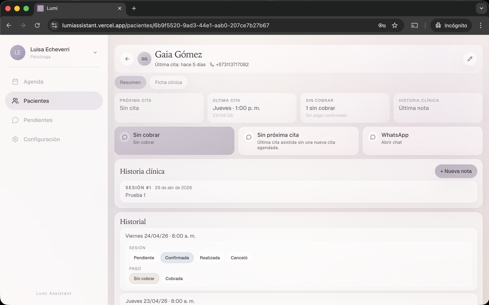
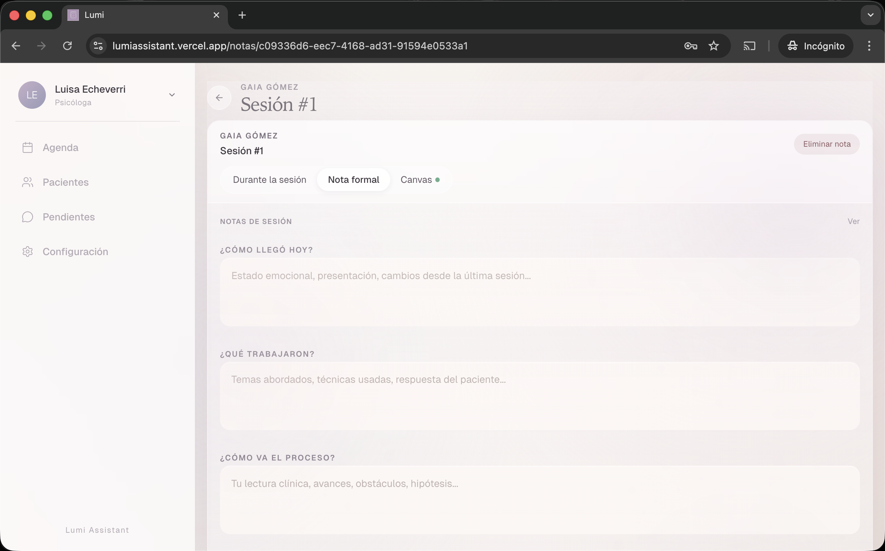

# Lumi — Clinical Operations App

Lumi is a clinical operations dashboard for independent psychology practices. It replaces scattered workflows across calendars, spreadsheets, note apps, and WhatsApp drafts with one authenticated workspace for daily clinical and administrative work.

Built end to end as a solo project, covering product scope, data modeling, frontend implementation, authentication, Row Level Security, timezone handling, Supabase storage, and test coverage.

[Live Demo](https://lumiassistant.vercel.app) · [Case Study](docs/case-study.md) · [Setup Guide](SETUP.md)

> Lumi handles private clinical data. The public demo uses fictional seeded data only.

---

## Preview

Screenshots and product walkthrough are available in the [case study](docs/case-study.md).

<!-- Add screenshots here when ready:



-->

---

## The Problem

Solo clinical practices often run across disconnected tools: calendars for appointments, spreadsheets for payments, separate apps for notes, and manual WhatsApp messages for patient follow-up.

That creates quiet operational risks: missed follow-ups, unpaid sessions, incomplete notes, duplicated work, and appointment times displayed incorrectly because of timezone handling.

Lumi brings those workflows into one place, designed around sessions, patients, clinical notes, and follow-up.

---

## What It Does

### Scheduling and agenda management

- Day, week, and month calendar views
- Appointment creation, editing, rescheduling, and cancellation
- Recurrence rules and conflict validation
- Independent tracking for session status and payment status
- Consultorio configuration for online and in-person sessions

### Patient records and clinical context

- Patient profiles with contact information and visit history
- Clinical profile data linked to each patient
- Session notes accessible from the patient profile
- Quick actions for common administrative tasks

### Session notes with canvas support

- Text-based formal session notes
- Drawing canvas for stylus workflows
- Editable canvas path data stored separately from rendered images
- Signed notes become read-only after closing

### Operational follow-up

- Pending-actions view for unpaid sessions, missing notes, and follow-ups
- Priority logic based on appointment status, payment status, and session history
- Reduced manual tracking across separate tools

### WhatsApp templates

- Configurable templates for reminders, confirmations, and follow-ups
- Manual sending flow through WhatsApp links
- Personalized message generation without full automation

### Practice settings

- Consultorio management
- Working hours configuration
- Booking link settings
- Profile and account management

---

## Technical Highlights

### Stack

| Layer | Technology | Why |
|---|---|---|
| Framework | Next.js App Router | Server-rendered dashboard pages with authenticated route protection through `proxy.ts`. |
| Frontend | React, TypeScript, Tailwind CSS 4 | Type-safe UI with consistent styling and interaction-heavy client components. |
| Backend | Supabase: Postgres, Auth, Storage, SSR | Managed Postgres with Row Level Security, authentication, and file storage for canvas images. |
| Testing | Vitest | Unit tests for the highest-risk business logic. |
| Key libraries | react-big-calendar, perfect-freehand, moment, lucide-react | Calendar views, pressure-sensitive drawing, date handling, and icons. |

---

## Architecture

```text
src/
├── app/
│   ├── login/
│   ├── api/
│   │   └── demo-login/      # Server-side demo login endpoint
│   └── (dashboard)/
│       ├── agenda/          # Calendar views and appointment management
│       ├── citas/           # Appointment detail pages
│       ├── pacientes/       # Patient list, profiles, and clinical history
│       ├── notas/           # Session notes and note creation
│       ├── whatsapp/        # Template configuration and message prep
│       ├── configuracion/   # Practice settings
│       └── profile/         # User profile
├── components/
│   ├── agenda/              # Calendar, day/week/month views
│   ├── appointments/        # Quick state editing and appointment helpers
│   ├── configuracion/       # Settings forms
│   ├── notes/               # Session notes and drawing canvas
│   ├── pacientes/           # Patient cards, profiles, quick actions
│   ├── profile/             # Profile management
│   └── ui/                  # Shared UI primitives
└── lib/
    ├── appointments/        # Appointment logic, recurrence, status, UI helpers
    ├── consultorios/        # Practice room configuration
    ├── dates/               # Bogotá timezone normalization and formatting
    ├── notes/               # Session note actions and storage
    ├── patients/            # Clinical profile client/server helpers
    ├── pending-actions/     # Follow-up priority calculation
    ├── profile/             # User profile helpers
    ├── settings/            # User settings and practice config
    ├── supabase/            # Supabase clients and data mappers
    └── whatsapp/            # Template rendering helpers
```

Server-rendered pages load authenticated data from Supabase. Client components handle calendar interactions, appointment modals, drawing canvas, and quick state changes. Business logic lives in dedicated `src/lib` domain modules, separated from UI code and independently testable.

---

## Key Technical Decisions

### Row Level Security as a product boundary

Every domain table has RLS policies that scope reads and writes to the authenticated user through `auth.uid()`. Patient data, appointments, notes, clinical profiles, consultorios, and settings are protected at the database layer, not only through UI logic.

### Bogotá-first timezone model

Lumi treats appointment inputs as local `America/Bogota` times, stores them as UTC instants in Postgres, and formats them back to Bogotá time for display. Date utilities centralize conversions to avoid scattered timezone bugs.

### Canvas storage strategy

Session note drawings store editable vector paths as JSONB and rendered images in Supabase Storage. This avoids storing large base64 blobs in Postgres while keeping drawings editable.

### Dedicated domain modules

Appointment recurrence, status transitions, pending-action priority, datetime formatting, settings, notes, WhatsApp templates, and Supabase mapping each live in their own module. This keeps UI components focused on rendering and makes business logic testable without mounting components.

### Server-side demo login

The public demo button signs in through a minimal server route at `/api/demo-login`, using server-only environment variables. Demo credentials stay out of the client bundle while keeping the portfolio demo accessible.

---

## Data Model

The schema covers:

- Patients
- Appointments with recurrence
- Session notes
- Clinical profiles
- Consultorios
- User settings
- WhatsApp templates
- Canvas storage paths

Full schema: [`supabase/schema.sql`](supabase/schema.sql)

---

## Tests

Unit tests cover:

- Date/time conversion and timezone edge cases
- Appointment recurrence generation
- Appointment and payment status transitions
- Pending-action priority logic

```bash
npm run test       # Run Vitest suite
npm run lint       # ESLint
npx tsc --noEmit   # TypeScript validation
```

---

## Local Setup

Requires a Supabase project with the schema applied.

```bash
npm install
cp .env.example .env.local
npm run dev
```

Environment variables:

```env
NEXT_PUBLIC_SUPABASE_URL=
NEXT_PUBLIC_SUPABASE_ANON_KEY=
NEXT_PUBLIC_BOOKING_URL=

# Server-only demo login
DEMO_EMAIL=
DEMO_PASSWORD=
```

For a fresh database, apply [`supabase/schema.sql`](supabase/schema.sql). Existing projects may need manual migrations from the `supabase/` directory.

Full setup notes: [`SETUP.md`](SETUP.md)

---

## Demo Data

Lumi includes a seed script that creates realistic fictional data for the public demo workspace and portfolio review.

The production demo uses a dedicated Supabase Auth user:

```text
demo@lumiassistant.com
```

Prerequisites:

- The demo user must exist in Supabase Auth before running the seed.
- `DEMO_EMAIL` and `DEMO_PASSWORD` must be configured locally and in Vercel for the View demo button.
- The database schema and required migrations must already be applied.

Steps:

1. In Supabase, go to the SQL Editor.
2. Open [`supabase/seed_demo.sql`](supabase/seed_demo.sql) and copy its full contents.
3. Paste into the SQL Editor.
4. Run the script.
5. Log in through the View demo button.

What the seed creates:

- 10 patients with realistic fictional profiles
- 25+ appointments spanning past, present, and future dates
- 3 consultorios: Online, Medellín, and Retiro
- 3 clinical profiles with background and therapeutic context
- 4 session notes: signed notes and drafts
- Settings for profile, working hours, booking link, and WhatsApp templates

All dates are relative to `CURRENT_DATE`, so demo data stays fresh with recent appointments, upcoming sessions, and realistic follow-up timelines.

---

## Commands

```bash
npm run dev       # Local development server
npm run build     # Production build
npm run start     # Run production build
npm run lint      # ESLint
npm run test      # Vitest unit tests
npx tsc --noEmit  # TypeScript type checking
```

---

## Project Status

Core product flows are implemented and deployed: agenda, patients, session notes, pending actions, WhatsApp templates, settings, and public demo access.

Current focus: documentation polish, screenshots, and portfolio presentation.

---

## Case Study

For a detailed walkthrough of the product decisions, technical challenges, and learnings, read the [case study](docs/case-study.md).